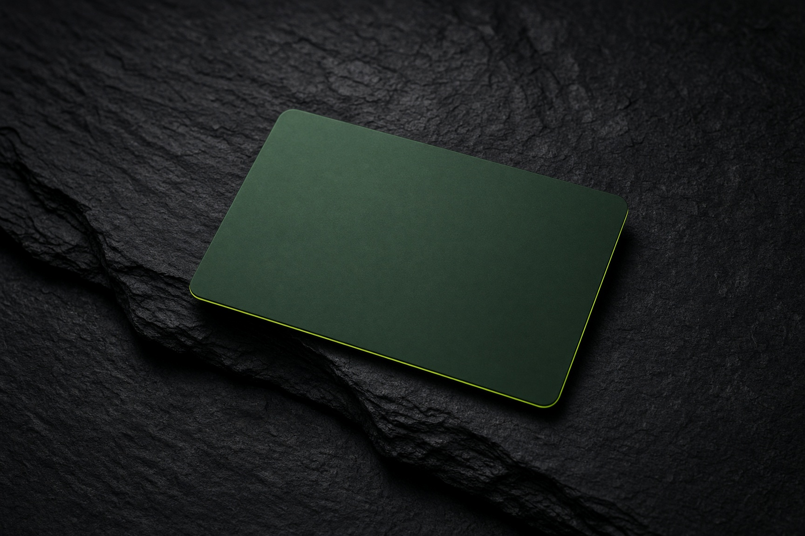
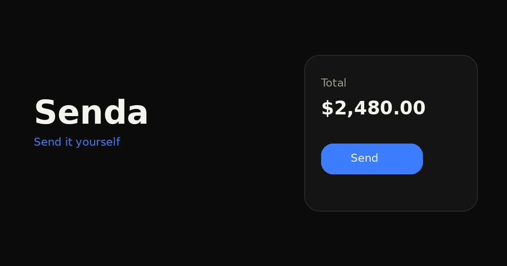

<p align="center">
  
</p>

<p align="center">
  <a href="https://img.shields.io/badge/Solana-pre--IPO-14151c?style=flat-square&logo=solana&logoColor=14F195"></a>
  <a href="https://img.shields.io/badge/custody-your%20wallet%20signs-c6f135?style=flat-square&labelColor=111111"></a>
  <a href="https://img.shields.io/badge/routes-Jupiter-14151c?style=flat-square"></a>
  <a href="https://img.shields.io/badge/wallets-Phantom%20%C2%B7%20Solflare%20%C2%B7%20Backpack-111111?style=flat-square"></a>
  <a href="https://github.com/ItsNotAILABS/Senda/commits/main"></a>
</p>

<h1 align="center">The desk for pre-IPO names that already trade.</h1>

<p align="center">
  Your wallet is the account. Jupiter quotes the route. You sign.<br>
  The print is the price, including after the brokerage apps have closed.
</p>

<p align="center">
  <a href="public/video/desk.mp4"></a>
  <a href="public/video/card.mp4"></a>
</p>

<p align="center"><sub>The stills are the films. Click either one.</sub></p>

---

Senda is the operating layer on top of tokenized pre-IPO names on Solana. Buy one. Hold it in the wallet you already have. Cover a drop. Spend without selling the token. Play the live print. Hand an agent a bound, and keep the signature for yourself.

A brokerage cannot see the mint, and it is closed at midnight. A raw swap page can fill a route and then leaves you there. Senda is the desk in between.

<p align="center">
  
</p>

## What you can do tonight

| | | |
| --- | --- | --- |
| **Buy** | A Jupiter quote into the mint. Simulated first. Signed in your wallet. | PreStocks |
| **Hold** | Portfolio is the token account, marked at the last print. Empty until the chain says otherwise. | Portfolio |
| **Convert** | SOL or USDC in, the name out. Or the slice back. One route, one signature. | Convert |
| **Cover** | Ten percent under the print you lock. Premium up front. The token stays put. Not a licensed policy. | Cover |
| **Play** | Ten games settled off the live book. Practice cash never touches the wallet. | Play |
| **Spend** | A number for a store, shown once. A charge hits Senda cash. A merchant may decline it. | Shop |
| **Send** | The same cash, to a person. Not a bank wire. | Send |
| **Arm** | An agent that can queue and cannot sign. The shift stops when you close the tab. | Agents |

## Why it belongs on Solana

The name is already a mint. The route is already on Jupiter. The key is already in Phantom, Solflare, or Backpack. Senda does not take custody to make any of that true. If the wallet is not in the browser, it is not offered. If the quote fails, nothing is invented.

## What is live

- Prints from the public pre-IPO book.
- A Jupiter quote, a simulation, and a signature in the wallet you connected.
- Holdings read back from token accounts.
- Practice play and real play, on two different balances.
- A cover with a premium and a strike. A shop number and a charge. An agent envelope with a spend cap.

Not built, and not dressed up as built: a brokerage account, margin, a bank wire, a card network a merchant must accept, an agent that holds its own key.

## Run

```bash
npm install
npm run dev
```

The desk is on port 8080. `npm run typecheck` has to pass.

Open the book. Load practice cash and play a print. Connect a wallet and quote the same name. Both moments use that print.

## For the people building on it

[AGENTS.md](AGENTS.md) is the manual. The same file is also `CLAUDE.md`, `GEMINI.md`, `llms.txt`, and the instruction files Cursor, Copilot, Windsurf, and Cline load on their own. Do not invent a balance, a card, or a position the wallet does not have.

The long note is [public/senda-submission.md](public/senda-submission.md). The PDF is [public/senda-submission.pdf](public/senda-submission.pdf).

<p align="center">
  
</p>

<p align="center"><sub>ItsNotAILABS · original work · <a href="https://github.com/ItsNotAILABS/Senda">github.com/ItsNotAILABS/Senda</a></sub></p>
